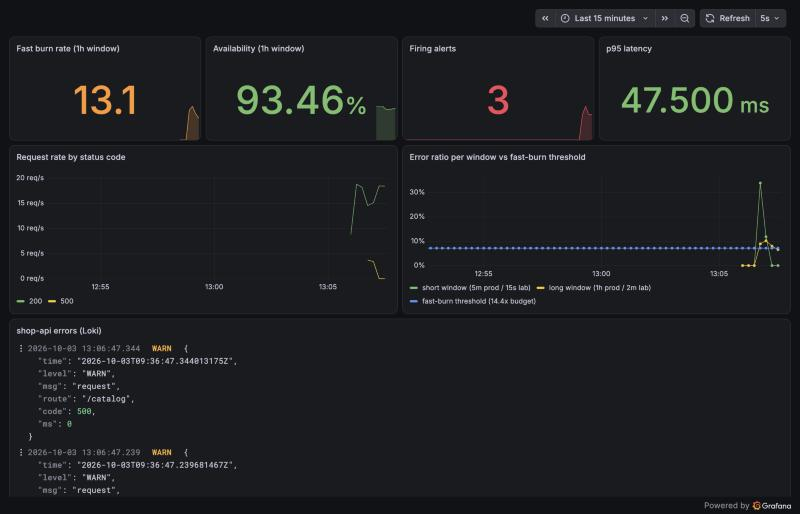

# sre-observability

A service that fails on purpose, and the monitoring that has to notice. The point
is not the dashboards: it is that every alert in this repo has been **made to fire
and made to clear** against real traffic, and the alert rules have unit tests.



```
loadgen ──▶ shop-api ──▶ /metrics ──▶ Prometheus ──▶ burn-rate alerts ──▶ Alertmanager ──▶ pager / ticket
               │                          └─▶ Grafana (dashboard as code)
               └─ JSON logs ──▶ Alloy ──▶ Loki ──▶ Grafana
          POST /admin/chaos?error_rate=0.3&latency_ms=500   injects the fault
```

## Run it

```bash
make test    # generate rules, promtool check + unit tests, Go tests
make up      # start the stack
make drill   # break the service, check the whole signal path, repair it
make down
```

Needs Docker with Compose v2, `jq`, Go, and `python3`. Grafana is on
http://localhost:13000 (anonymous viewer; admin password is `lab-admin`, lab only).

## What the alerts are

**SLO:** 99.5% of requests succeed (budget: 0.5%). Alerting is
**multi-window, multi-burn-rate**, from the Google SRE Workbook:

| Alert | Burn | Windows | Severity |
|---|---|---|---|
| `SLOFastBurn` | 14.4x | 1h and 5m | page |
| `SLOSlowBurn` | 6x | 6h and 30m | page |
| `SLOBudgetBurnTicket` | 3x | 1d and 2h | ticket |
| `SLOBudgetLeak` | 1x | 3d and 6h | ticket |

Why two windows: the long one proves the problem is sustained (no paging on a
blip), the short one proves it is still happening (the page clears minutes after a
fix, not an hour). Why several speeds: a total outage and a slow leak need
different responses, and one threshold gets one of them wrong.

The rules are **generated** (`scripts/gen-slo-rules.py`) from one table, so the
windows, thresholds and runbook links cannot drift apart across 4 alerts.

## Two profiles, one definition

| Profile | Windows | Used for |
|---|---|---|
| `prod` | 5m, 30m, 1h, 2h, 6h, 1d, 3d | what you would deploy; committed as `prometheus/rules/slo.prod.rules.yml`; unit-tested |
| `lab` | the same, divided by ~30 | the live drill, so an alert fires in seconds instead of an hour |

## Tested at two levels

**Unit tests** (`promtool test rules`, `prometheus/rules/tests/slo_test.yml`):

- sustained 10% errors pages;
- a 3-minute outage after 90 healthy minutes does **not** page;
- a 2% slow bleed tickets but does not page;
- healthy traffic never alerts.

These were checked by **mutation**: breaking the fast-burn rule so it only looks at
the short window makes the "brief spike" test fail. The first version of that test
did not catch the mutation (it had under an hour of history, so the "1h" window
was really 16 minutes); it only became meaningful once it had a healthy lead-in.

**Live drill** (`make drill`, `scripts/chaos-drill.sh`): healthy baseline must be
silent, then 30% errors are injected and the script checks that the alert fires,
that Alertmanager routes it to the `pager` receiver, that the failing requests are
searchable in Loki, that the dashboard is provisioned, and that the alert clears
after the fault is removed.

| Measurement (lab profile) | Value |
|---|---|
| Healthy baseline alerts | none |
| Fault injected → `SLOFastBurn` firing | 21 s |
| Fault removed → alert resolved | 14 s |
| Routed to | `pager` |
| Errors visible in Loki | yes |

A single local run, with windows scaled down ~30x. It proves the signal path, not
a production detection time.

## Runbooks

- [`runbooks/slo-burn.md`](runbooks/slo-burn.md)
- [`runbooks/high-latency.md`](runbooks/high-latency.md)

Every alert carries a `runbook_url` annotation pointing at one of these.

## Deliberately out of scope

- Real notification integrations (the receivers are empty on purpose).
- Long-term metrics storage and HA Prometheus.
- Tracing.
- Authentication on Grafana and the admin endpoint (lab only).

## License

MIT
